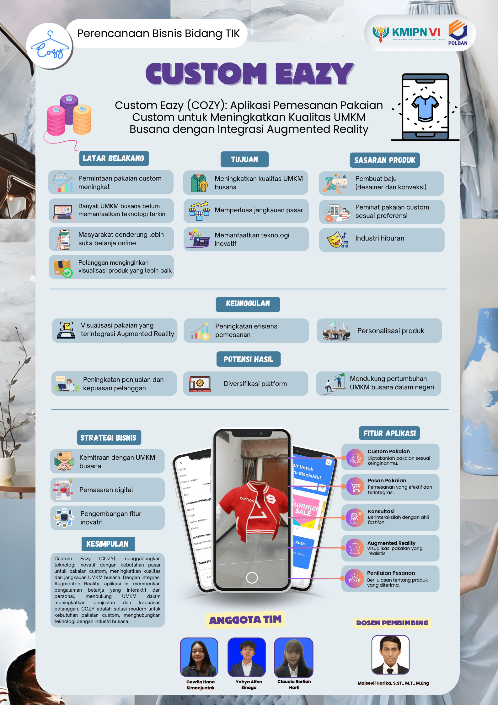
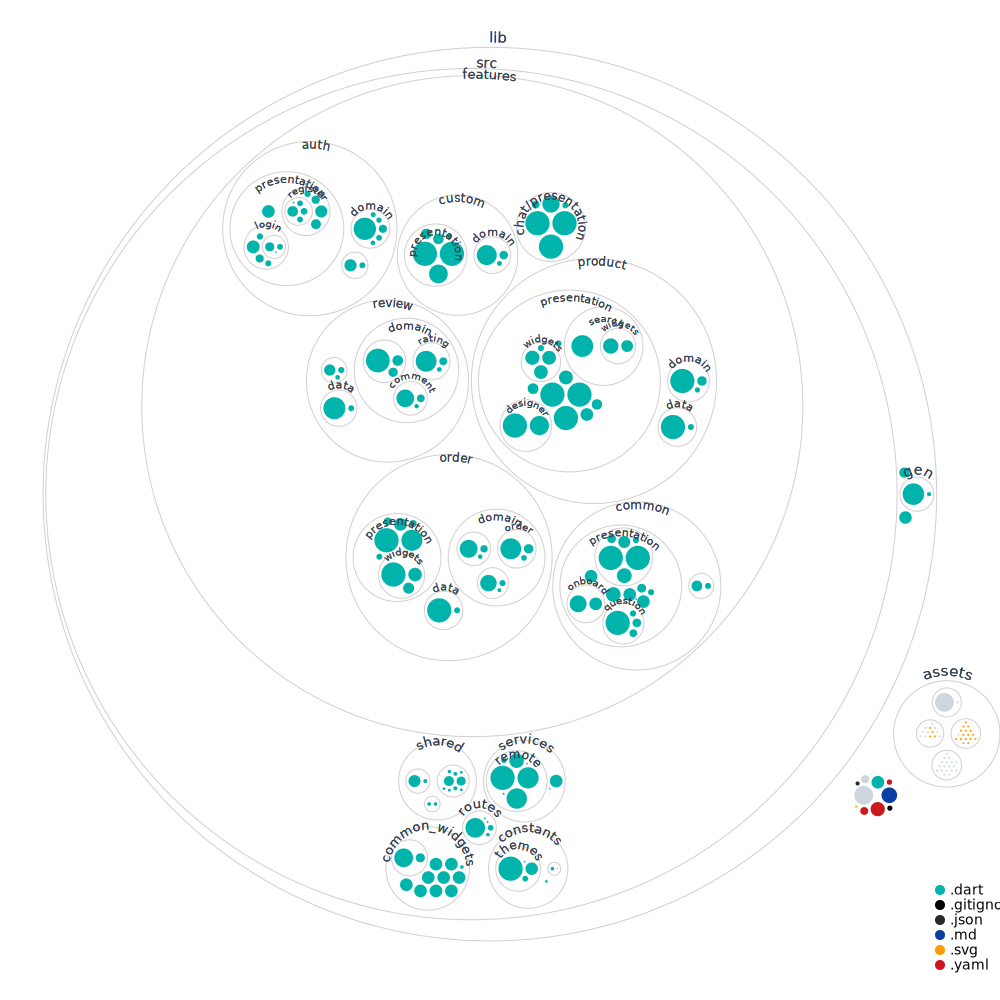

# COZY - Personalized Fashion Redefined  

Welcome to **COZY** (Custom Eazy), the ultimate app for custom-designed clothing. Built with the power of Flutter, COZY empowers users to craft their unique styles effortlessly while leveraging cutting-edge technologies like Augmented Reality (AR) to preview designs in real-time. Let your creativity shine with COZY!

---

## 🌟 COZY Poster

Check out our stunning promotional poster for COZY! This poster highlights the key features and benefits of our app, designed to captivate and inform potential users.



Download the poster and share it with your friends to spread the word about COZY!

## Features

### 🌟 Key Highlights

1. **Custom Clothing**:
   - Personalize every detail of your clothing: size, color, material, design, and more.
2. **Augmented Reality Integration**:
   - Preview your custom designs virtually before placing an order.
3. **Designer Consultation**:
   - Chat with professional designers to ensure the perfect fit and design.
4. **Seamless Transactions**:
   - Fast and secure payment methods for a smooth shopping experience.

### 🎨 User Experience

- Intuitive interface for a hassle-free clothing customization journey.
- Real-time AR feedback on designs.
- Personalized recommendations based on user preferences.

---

## Tech Stack

COZY is crafted using **Flutter**, a cross-platform framework, to ensure exceptional performance and aesthetics across devices. Here are the tools and libraries that bring COZY to life:

### 📦 Dependencies

- **[cached_network_image](https://pub.dev/packages/cached_network_image)**: Efficient image loading and caching.
- **[card_swiper](https://pub.dev/packages/card_swiper)**: Smooth card-swiping animations.
- **[cloud_firestore](https://pub.dev/packages/cloud_firestore)**: Seamless database integration with Firebase.
- **[cupertino_icons](https://pub.dev/packages/cupertino_icons)**: Access to high-quality icons for iOS-style design.
- **[custom_refresh_indicator](https://pub.dev/packages/custom_refresh_indicator)**: Interactive pull-to-refresh animations.
- **[dio](https://pub.dev/packages/dio)**: Advanced HTTP requests handling.
- **[dots_indicator](https://pub.dev/packages/dots_indicator)**: Elegant indicators for page transitions.
- **[file_picker](https://pub.dev/packages/file_picker)**: File selection from local storage.
- **[firebase_auth](https://pub.dev/packages/firebase_auth)**: Secure user authentication.
- **[firebase_core](https://pub.dev/packages/firebase_core)**: Firebase initialization.
- **[firebase_storage](https://pub.dev/packages/firebase_storage)**: Media storage on Firebase.
- **[flutter_chat_types](https://pub.dev/packages/flutter_chat_types)** & **[flutter_chat_ui](https://pub.dev/packages/flutter_chat_ui)**: Powering real-time chat features.
- **[flutter_rating_stars](https://pub.dev/packages/flutter_rating_stars)**: User-friendly rating system.
- **[flutter_riverpod](https://pub.dev/packages/flutter_riverpod)**: State management made simple.
- **[go_router](https://pub.dev/packages/go_router)**: Flexible and powerful navigation.
- **[intl](https://pub.dev/packages/intl)**: Localization support for a global audience.
- **[model_viewer_plus](https://pub.dev/packages/model_viewer_plus)**: AR model visualization.
- **[quickalert](https://pub.dev/packages/quickalert)**: Beautiful and interactive alert dialogs.
- ...and many more to ensure a top-notch user experience.

### 🛠️ Dev Dependencies

- **[build_runner](https://pub.dev/packages/build_runner)**: Code generation utilities.
- **[flutter_gen_runner](https://pub.dev/packages/flutter_gen_runner)**: Asset and code generation.
- **[freezed](https://pub.dev/packages/freezed)**: Immutable data classes.
- **[riverpod_generator](https://pub.dev/packages/riverpod_generator)**: Automated state management setup.
- **[json_serializable](https://pub.dev/packages/json_serializable)**: JSON parsing made easy.

---

## 📊 Repository Visualization

To better understand the structure and flow of the COZY project, here is a visual representation of the repository:



This visualization provides a high-level overview of the project's organization, making it easier to navigate and contribute.

## Getting Started

Follow these simple steps to run COZY on your local machine:

### Prerequisites

1. Install [Flutter](https://flutter.dev/docs/get-started/install) (latest stable version recommended).
2. Set up Firebase project for authentication and Firestore database.
3. Clone this repository:

   ```bash
   git clone https://github.com/codeyzx/cozy.git
   ```

4. Navigate to the project directory:

   ```bash
   cd cozy
   ```

5. Install dependencies:

   ```bash
   flutter pub get
   ```

### Running the App

1. Ensure your emulator or physical device is connected.
2. Launch the app using:

   ```bash
   flutter run
   ```

---

## How to Use COZY

1. **Sign Up / Log In**:
   - Create an account or sign in using Google/Firebase Authentication.
2. **Browse and Customize**:
   - Explore clothing options, customize designs, and see AR previews.
3. **Consult Designers**:
   - Get expert advice for the perfect fit and design.
4. **Order and Pay**:
   - Place your order securely and effortlessly.
5. **Track Your Order**:
   - Stay updated with real-time tracking.

---

## 📹 Overview App

Check out this quick overview of the COZY app in action!


For a full video demonstration, visit [this link](https://drive.google.com/file/d/1piMR4fx6MmfXIsZSc0q-niAwQ1JoYw0U/view?usp=sharing).

---

## Contribution

We welcome contributions from the community! Follow the steps below to contribute:

1. Fork the repository.
2. Create a new branch for your feature:

   ```bash
   git checkout -b feature-name
   ```

3. Commit your changes and push:

   ```bash
   git push origin feature-name
   ```

4. Open a pull request.

---

## License

This project is licensed under the MIT License. See the LICENSE file for details.

---

## Contact

For queries or collaborations, feel free to reach out at my instagram
[@yahyaalfon](https://www.instagram.com/yahyaalfon)

---
